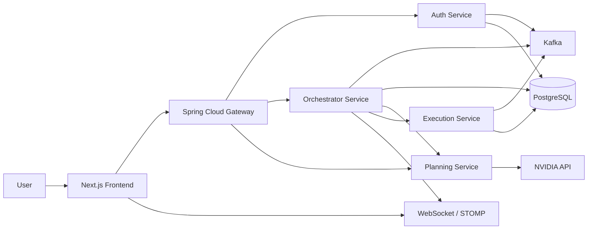

# OrynX

An event-driven workflow orchestration platform that combines a Next.js control plane with Spring Boot microservices, Kafka-based messaging, PostgreSQL persistence, and AI-assisted workflow planning.

---

# Overview

OrynX is a distributed workflow platform designed to create, monitor, and execute operational workflows from a single interface. The repository currently contains a working frontend dashboard, several backend services for authentication, orchestration, planning, execution, and API routing, plus infrastructure definitions for PostgreSQL, Redis, and Kafka.

The platform exists to help teams observe workflow execution in real time, generate workflow plans from high-level goals, and coordinate task execution across multiple services. It is intended for developers and technical teams who want a reference implementation of an event-driven orchestration system with AI planning hooks.

---

# Key Features

- Real-time workflow dashboard with live updates through WebSockets and Kafka events
- Workflow creation and lifecycle management via REST endpoints
- AI-assisted workflow plan generation using the NVIDIA API through the planning service
- Event-driven execution flow between orchestrator and execution services
- Analytics and performance monitoring for workflows and tasks
- JWT-based authentication and user registration via the auth service
- API gateway routing for backend services
- Docker Compose support for core infrastructure dependencies

---

# Architecture

The repository follows a service-oriented architecture with a frontend control plane and multiple backend services connected by Kafka and HTTP.



The current implementation is centered around these components:

- Frontend: a dashboard for visualizing workflow status, analytics, health, and live events
- Gateway service: routes requests to auth, workflow, AI, and planning endpoints
- Auth service: handles user registration/login and JWT issuance
- Orchestrator service: owns workflows, task state, analytics, performance metrics, and event publication
- Planning service: generates workflow plans from natural language goals using an external AI API
- Execution service: consumes execution requests and simulates task execution flow

---

# Tech Stack

## Programming Languages

- Java 21
- TypeScript
- JavaScript

## Frameworks

- Spring Boot 3.x
- Spring Cloud Gateway
- Spring Security
- Spring Data JPA
- Next.js 16
- React 19
- Tailwind CSS

## AI Technologies

- NVIDIA AI API integration for chat completions
- LLM-powered workflow plan generation

## Databases

- PostgreSQL

## Cloud Services

- Not available in the current repository

## DevOps

- Docker Compose
- Maven
- npm

## Infrastructure

- Kafka
- Redis
- Docker

## Libraries

- WebSocket/STOMP for live updates
- Resilience4j for retry and circuit breaker protection
- Lombok for Java boilerplate reduction
- JWT (jjwt) for authentication

---

# Project Structure

```text
.
├── docker-compose.yml
├── package.json
├── README.md
├── About/                  # Architecture and design documents
├── architecture/           # Additional architecture assets
├── docs/                   # Empty in the current snapshot
├── frontend/               # Next.js dashboard application
│   ├── src/app/            # App router pages and layout
│   ├── src/components/     # UI components such as workflow graph visualization
│   ├── src/services/      # API and WebSocket clients
│   ├── src/store/         # Zustand store for task status state
│   └── src/types/         # Frontend type definitions
├── infra/                  # Deployment directories (currently empty)
├── services/               # Backend microservices
│   ├── auth-service/       # User authentication and JWT issuance
│   ├── execution-service/  # Workflow execution engine
│   ├── gateway-service/    # API gateway routing
│   ├── orchestrator-service/ # Workflow orchestration, analytics, events, and WebSocket streaming
│   ├── planning-service/   # AI workflow planning service
│   └── ...                 # Additional service folders present but currently empty
```

---

# How It Works

1. A user opens the frontend dashboard and views workflow metrics and activity.
2. A workflow can be created manually through the orchestrator API or generated from a natural-language goal via the AI workflow endpoint.
3. The planning service calls the NVIDIA API to produce a concise workflow plan with a fixed number of tasks.
4. The orchestrator service stores the workflow and its tasks in PostgreSQL and publishes workflow events to Kafka.
5. The execution service consumes execution requests and simulates task execution while emitting task and workflow completion events.
6. The orchestrator service persists execution events and pushes updates to the frontend over WebSocket/STOMP channels.

---

# Prerequisites

Install the following software before running the project locally:

- Java 21 or newer
- Maven 3.9+
- Node.js 20+
- npm 10+
- Docker Desktop with Docker Compose support

---

# Installation

1. Clone the repository:

```bash
git clone <repository-url>
cd OrynX
```

2. Start the infrastructure services:

```bash
docker compose up -d postgres redis kafka
```

3. Install the frontend dependencies:

```bash
cd frontend
npm install
```

4. Build or run the backend services individually:

```bash
cd services/auth-service
./mvnw spring-boot:run
```

```bash
cd ../gateway-service
./mvnw spring-boot:run
```

```bash
cd ../planning-service
./mvnw spring-boot:run
```

```bash
cd ../orchestrator-service
./mvnw spring-boot:run
```

```bash
cd ../execution-service
./mvnw spring-boot:run
```

On Windows, use the Maven wrapper script with the .cmd variant if needed.

---

# Configuration

Configuration is currently defined in Spring Boot property files under the service directories.

## Environment variables

- NVIDIA_API_KEY: required by the planning and orchestrator services for AI workflow generation

## Configuration files

- Root Docker Compose file: docker-compose.yml
- Frontend environment base URL: frontend/src/services/api.ts and frontend/src/services/websocket.ts use NEXT_PUBLIC_API_BASE_URL and NEXT_PUBLIC_WS_BASE_URL if set; otherwise they default to localhost ports
- Service configuration:
  - services/auth-service/src/main/resources/application.properties
  - services/gateway-service/src/main/resources/application.properties
  - services/orchestrator-service/src/main/resources/application.properties
  - services/planning-service/src/main/resources/application.properties
  - services/execution-service/src/main/resources/application.properties

Note: the repository does not currently include an .env.example or a centralized secret-management layer.

---

# Running the Project

## Local development

Start the infrastructure:

```bash
docker compose up -d postgres redis kafka
```

Start the backend services in separate terminals:

```bash
cd services/auth-service && ./mvnw spring-boot:run
cd services/gateway-service && ./mvnw spring-boot:run
cd services/planning-service && ./mvnw spring-boot:run
cd services/orchestrator-service && ./mvnw spring-boot:run
cd services/execution-service && ./mvnw spring-boot:run
```

Start the frontend:

```bash
cd frontend
npm run dev
```

The frontend is expected to run on http://localhost:3000, while the gateway is exposed on http://localhost:8080.

## Production-like runs

The repository does not currently provide production deployment manifests or container images for all services. The available deployment-oriented assets are the Docker Compose infrastructure definitions and Spring Boot services that can be packaged and deployed separately.

---

# API Documentation

The gateway service exposes the following routes.

## Authentication

- POST /api/v1/users/register
  - Registers a user
  - Request body: email, password
- POST /api/v1/users/login
  - Authenticates a user and returns a JWT token
  - Request body: email, password
- GET /api/v1/auth/health
  - Health check endpoint for the auth service

## Workflows

- POST /api/v1/workflows
  - Creates a workflow
- PATCH /api/v1/workflows/{id}/start
  - Starts a workflow by ID
- GET /api/v1/workflows
  - Retrieves all workflows

## AI workflow endpoints

- POST /api/v1/ai/plan
  - Returns a planned workflow from a natural-language goal
- POST /api/v1/ai/workflows
  - Creates a workflow from a natural-language goal using the AI planning path

## Planning service

- POST /api/v1/plans
  - Generates an AI workflow plan from a goal

## Analytics and monitoring

- GET /api/v1/analytics
- GET /api/v1/performance
- GET /api/v1/performance/summary
- GET /api/v1/performance/health
- GET /api/v1/timeline/{workflowId}

## Authentication model

The auth service uses JWT-based authentication with Spring Security. The repository currently exposes public endpoints for health and authentication routes; other protected endpoints require a valid token.

---

# Database

The repository uses PostgreSQL as the relational database.

## Current schema behavior

The services configure Hibernate with `spring.jpa.hibernate.ddl-auto=update`, which means the schema is generated or updated automatically at runtime.

## Observed persistence areas

- Workflows and workflow tasks in the orchestrator service
- Execution events in the orchestrator service
- Users in the auth service

## Migrations

Database migrations are not present in the current repository snapshot.

## Seed data

No seed data files are included.

---

# AI Components

The repository includes an AI-assisted planning flow.

- Planning service: calls the NVIDIA chat completions API
- Model: `meta/llama-3.1-8b-instruct`
- Prompting: the service generates a workflow name and five tasks from a user goal
- Integration: the orchestrator service calls the planning service through a dedicated client with retry and circuit breaker protection

The repository does not currently include:

- Vector database integration
- Embedding generation
- RAG or GraphRAG implementation
- A full multi-agent framework in the running codebase

---

# Deployment

## Infrastructure deployment

The repository includes Docker Compose definitions for:

- PostgreSQL
- Redis
- Kafka

## Service deployment

The Spring Boot services are runnable locally through the Maven wrapper. Container definitions for the individual services are not present in the current repository snapshot.

## Kubernetes

The infra/kubernetes directory exists but is currently empty. No Kubernetes manifests are included in this repository snapshot.

---

# Security

Security considerations present in the repository include:

- JWT-based authentication in the auth service
- Password hashing through Spring Security password encoding
- Stateless session management
- CSRF disabled in the auth service security configuration

Security gaps or areas to improve:

- Secrets are currently stored directly in application properties files
- No external secret manager integration is present
- No production-grade TLS, ingress, or role-based access model is wired into the repository snapshot

---

# Logging & Monitoring

The repository includes:

- Spring Boot Actuator exposure on the services
- Request logging filters in the gateway and orchestrator services
- Kafka event logging and WebSocket event propagation

The repository does not currently include a complete observability stack such as Prometheus, Grafana, or OpenTelemetry configuration.

---

# Testing

The repository includes Spring Boot application tests for the main services.

Current test coverage includes:

- auth-service
- gateway-service
- orchestrator-service
- execution-service
- planning-service

Run tests with:

```bash
cd services/auth-service && ./mvnw test
cd services/gateway-service && ./mvnw test
cd services/orchestrator-service && ./mvnw test
cd services/execution-service && ./mvnw test
cd services/planning-service && ./mvnw test
```

---

# Future Improvements

Potential enhancements for the repository include:

- Add container images and deployment manifests for each service
- Introduce Kubernetes and Helm-based deployment
- Externalize configuration using environment variables or a secret manager
- Add persistent migrations with Flyway or Liquibase
- Expand the AI workflow engine into a richer multi-agent orchestration model
- Implement a true memory service, vector search layer, and graph-based knowledge store
- Add Prometheus, Grafana, and tracing integration

---

# Contributing

Contributions are welcome. A good starting point is:

1. Fork the repository
2. Create a feature branch
3. Make changes and add or update tests
4. Run the relevant Maven tests
5. Open a pull request with a clear description of the change

---

# License

The repository includes a LICENSE file, but it currently contains the placeholder text `TODO: Add license text.` No final license has been specified in the current repository snapshot.

---

# Acknowledgements

This project builds on a range of excellent open-source tools and frameworks, including:

- Spring Boot
- Spring Cloud Gateway
- Next.js
- React
- Kafka
- PostgreSQL
- Docker
- Resilience4j
- JWT / jjwt
